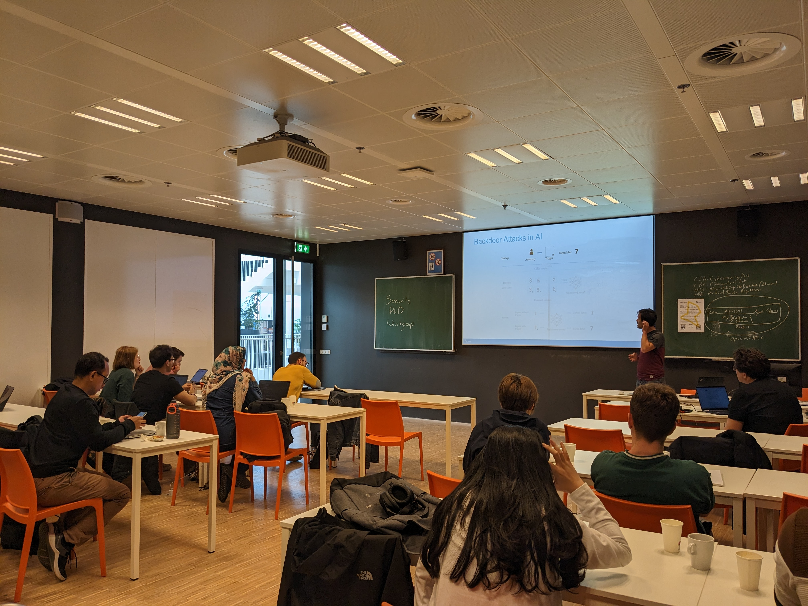

## Where

Leiden University - Gorlaeus Gebouw, room TBA 

## When

On the 30th of April 

## Program
-	11.00 – 11.30: Coffee 
-	11.30 – 13.00: Talks
	1.  Nathan Schiele (Leiden University): Modelling threats in a forest of attack defence trees
	2.  Cristian Daniele (Radboud University): [AFL* a simple approach to fuzzing stateful systems](../Slides/2024%20April/%20AFL*%20a%20simple%20approach%20to%20fuzzing%20stateful%20systems.pdf)
	3.  Jan Acken (Utrecht University): [Shadow IT Mindsets of Corporate Employees](../Slides/2024%20April/Shadow%20IT%20Mindsets%20of%20Corportate%20Employees.pdf)
	4.  Zahra Hatefi (Eindhoven University): [Exploring the Security Landscape of Open-Source IoT Software](../Slides/2024%20April/Exploring%20the%20Security%20Landscape%20of%20Open-Source%20IoT%20Software%20on%20GitHub.pdf)
	5.  I Puti Arya Dharmaadi (Groningen University): [Server-side Web Application Fuzzing](../Slides/2024%20April/Web%20API%20Fuzzing.pdf)
-	13.00 – 14.00: Lunch 
-	14.00 – 15.30: Talks
	1. Shuang Sun(Leiden University): [MPC in the processing model](../Slides/2024%20April/MPC%20in%20the%20Preprocessing%20Model.pdf)
	2. Pratham Ajmera (Tilburg University)
	3. Lisa Rooij(Tilburg University): [The paradigm shift in patching regulation - upcoming EU rules for cybersecurity patching](../Slides/2024%20April/The%20paradigm%20shift%20in%20patching%20regulations.pdf)
	4. Stefanos Koffas (Delft University): Backdoor Attacks in Speech Recognition
	5. Edzo Botjes (Open University): [Creating a business value from cyber resilience. Moving towards antifragility through organizational learning](../Slides/2024%20April/Cyber%20Resilience.pdf)
-	15.30 – 16.30: Drinks

