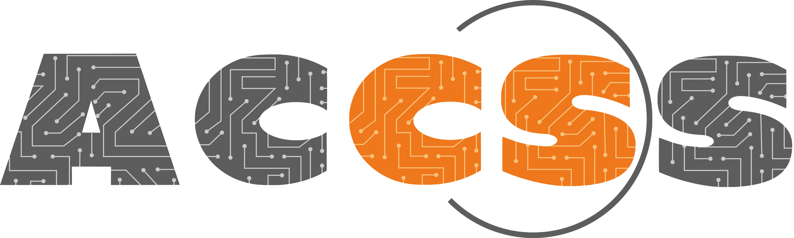

<!---->
## Date

**The 5th PhD Workgroup Netherlands** will take place in Leiden on September 2nd, 2026.

## Venue

The workgroup will be held in **Room BW.0.18 of Gorlaeus Gebouw**, Leiden University.

[Open in Google Maps](https://maps.app.goo.gl/CYcCMd47YxwpY8NCA)

## Registration

The registration is free and includes coffee breaks, lunch, and drinks.

[SIGN UP HERE](https://docs.google.com/forms/d/e/1FAIpQLSdnkkHdFJuch1-THGNI9gD3m0qjWURdwVU6GcwFhKoO5_JZdw/viewform?usp=publish-editor)

## Program

| Time |  |
|---|---|
| 10:00 - 10:30  | Welcome coffee & Opening |
| 10:30 - 11:00  | Talk: **TBD** Speaker: Cristian Daniele (TNO) Brief Introduction  ...   |
| 11:00 - 11:30  | Talk: **Can LLMs produce an infinite poem?** Speaker: Vincent Cellucci (Leiden University) LIACS external PhD candidate and poet Vincent Cellucci will contextualize and perform from his recent project, resurrection (2024-2026), which has incorporated and tested the limits of LLMs. He hopes to collect some human-generated couplets from the audience! |
| 11:30 - 12:00  | Talk: **TBD** Sengim Karayalcin (Leiden University) Brief Introduction  ...   |
| 12:00 - 13:30  | Lunch |
| 13:30 - 14:00  | Talk: **TBD** Nathan Schiele (Leiden University) Brief Introduction  ...   |
| 14:00 - 14:30  | Talk: **TBD** Jafar Akhoundali (Leiden University) Brief Introduction  ...   |
| 14:30 - 15:00  | Talk: **A study of cursorrules files in open source repositories** Shuang Sun (Leiden University) Brief Introduction  ...   |
| 15:00 - 16:00  | Goodbye Drinks |

## Contact Us

For questions regarding the workgroup, or you have cool ideas for the next meeting, please contact [Cristian Daniele](mailto:<cristian.daniele@ru.nl>) or [Shuang Sun](mailto:<s.sun@liacs.leidenuniv.nl>).

## Sponsors
 ACCSS  | INTERSCT  |
----|----|
  |  
