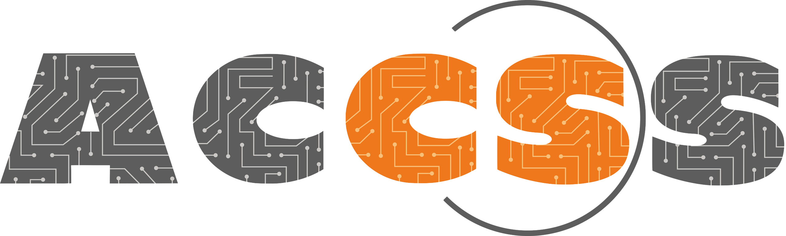

# PhD Workgroup Netherlands
This page will collect all the PhD Workgroup meetings in the Netherlands organised by PhD students for PhD students in collaboration with ACCSS and INTERSCT.

If you're interested in the world of Computer Security and want to learn about the research of other PhD students in the Netherlands, join our meeting. The workshop is also an excellent opportunity to build collaborations and expand your network!

# Next meeting

- **Where**: Utrecht University 
- **When**: November 2024
- **Program**: TBA

## Past meetings

Date| University| Program|
---|----|----|
April 2024| Leiden University | [here](./Meetings/2024-April.md)|
October 2023| Radboud University | [here](./Meetings/2023-October.md)|

## Contacts

If you want to register for the next meeting, or you have cool ideas to share, you can contact:
- Cristian Daniele: cristian.daniele@ru.nl
- Arina Kudriavtseva: a.kudriavtseva@liacs.leidenuniv.nl

## Sponsors
 ACCSS  | INTERSCT  |
----|----|
  |  