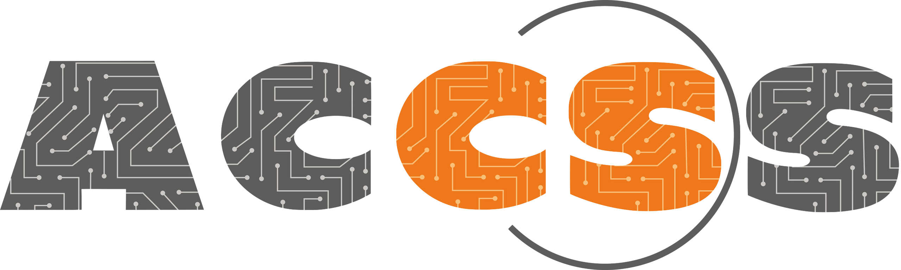

# ACCSS PhD Workgroup
This page will collect all the PhD Workgroup meetings in the Netherlands organised by PhD students for PhD students in collaboration with ACCSS and INTERSCT.

If you're interested in the world of Computer Security and want to learn about the research of other PhD students in the Netherlands, join our meeting. The workshop is also an excellent opportunity to build collaborations and expand your network!

# Next PhD Workshop

- **Where**: Gorlaeus Gebouw, room BW.0.18, Leiden University
- **When**: 2nd September, 2026
- **Program**: [here](./Meetings/2026-September.md)
- **Free registration (to attend/present)**: [here](https://docs.google.com/forms/d/e/1FAIpQLSdnkkHdFJuch1-THGNI9gD3m0qjWURdwVU6GcwFhKoO5_JZdw/viewform?usp=publish-editor)

## Past PhD Workshops

Date| University| Program|
---|----|----|
November 2024| Utrecht University | [here](./Meetings/2024-November.md)|
April 2024| Leiden University | [here](./Meetings/2024-April.md)|
October 2023| Radboud University | [here](./Meetings/2023-October.md)|

## Contacts

If you want to register for the next meeting, or you have cool ideas to share, you can contact:
- Cristian Daniele: cristian.daniele@ru.nl
- Shuang Sun: s.sun@liacs.leidenuniv.nl

## Sponsors
 ACCSS  | INTERSCT  |
----|----|
  |  
